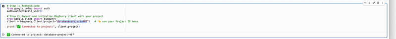

Hello, and welcome to our analysis on The Look!  To reproduce our individual results, simply replace the project line...

"client = bigquery.Client(project="database-project-467")   # 👈 use your Project ID here

with your own GCP project name.  After you do this, the queries integrated in Python should all work as intended.  We also included a report in our team folder illustrating all of our findings.

